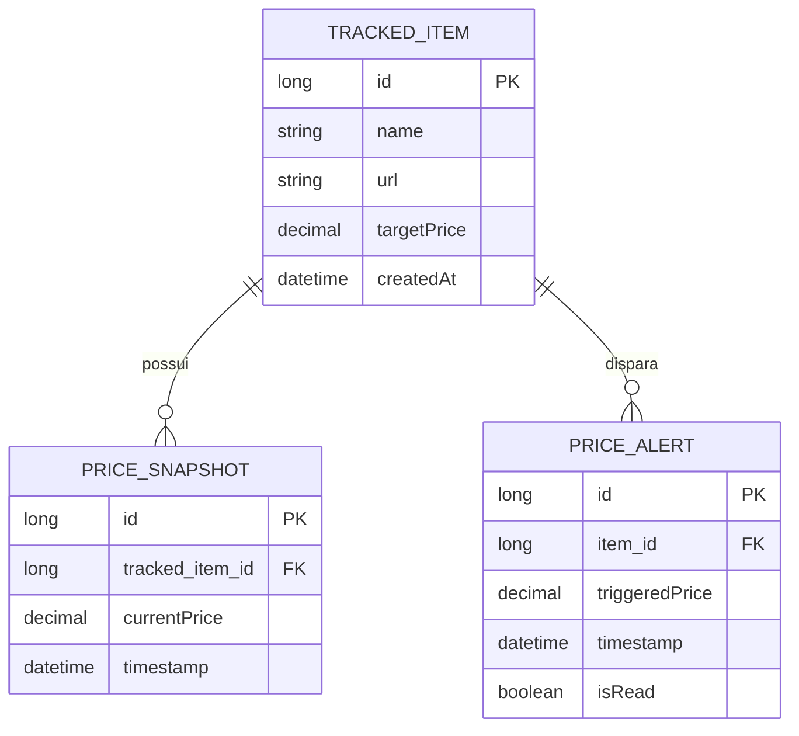
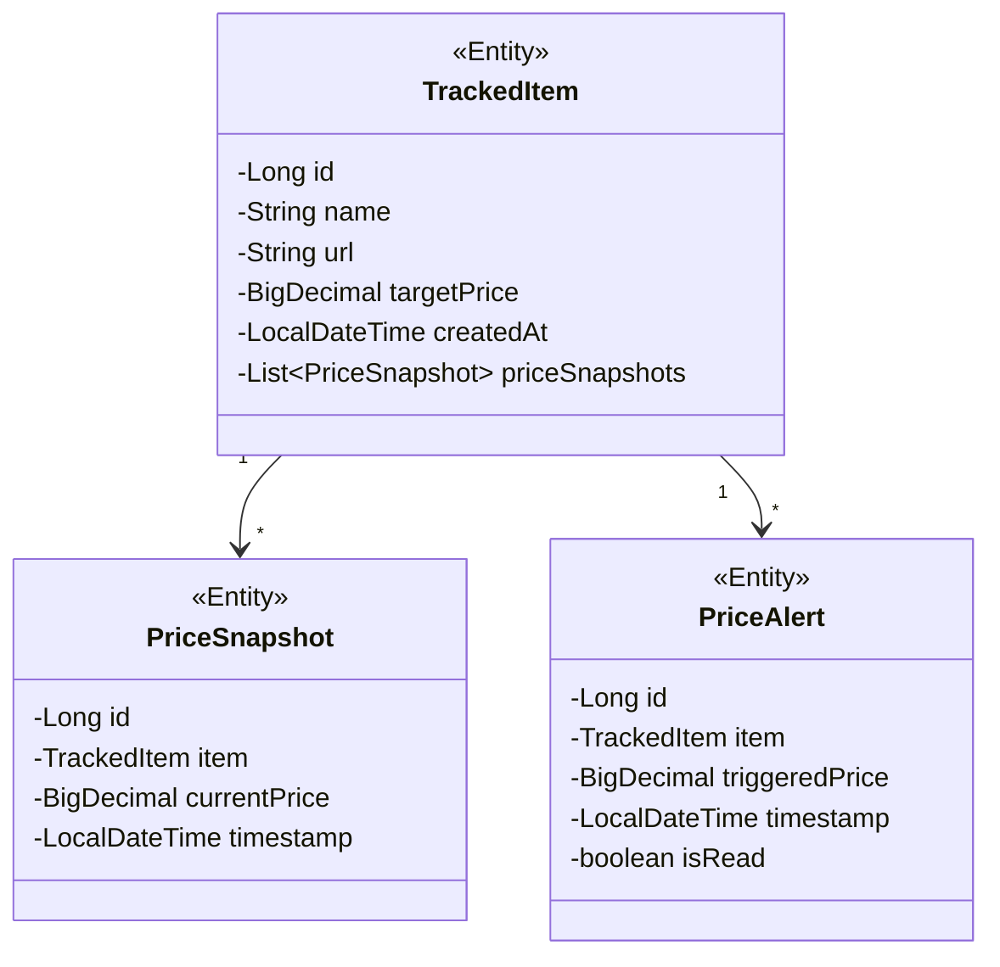
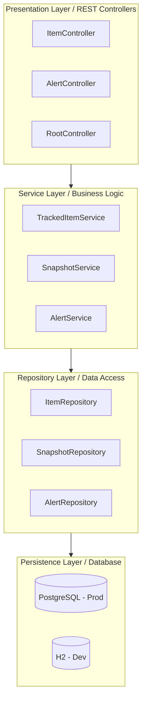
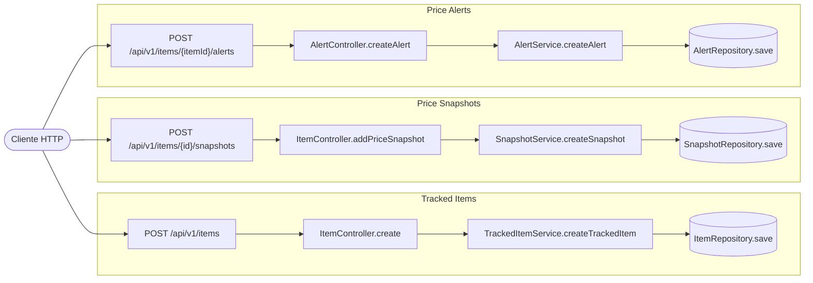

# 📊 PriceRadar API

[](https://www.oracle.com/java/technologies/javase/jdk21-archive-downloads.html)
[](https://spring.io/projects/spring-boot)
[](https://maven.apache.org/)
[](LICENSE)
[]()

> API RESTful para monitoramento inteligente de preços com sistema de alertas automáticos

**[📖 Documentação](#-documentação)** • **[🏗️ Arquitetura](#-model-de-dados-e-relacionamentos)** • **[📖 API Docs](#-api-endpoints)** • **[⚡ Quick Ref](./QUICK_REFERENCE.md)**


## 🚀 Live Demo e Documentação (Swagger)

A API está em produção e utiliza uma infraestrutura moderna e escalável: o backend está hospedado no **Render** e a persistência de dados é gerenciada pelo **Neon** (PostgreSQL Serverless).

- **Base URL da API:** `https://priceradar-api-duxl.onrender.com`
- **Documentação Interativa (Swagger):** [Acessar Swagger UI](https://priceradar-api-duxl.onrender.com/swagger-ui/index.html#/)

> **ℹ️ Nota sobre o Render (Free Tier):** Por estar hospedada em uma instância gratuita, a API entra em estado de "hibernação" após um período de inatividade. Caso o link demore cerca de **50 a 60 segundos** para carregar na primeira vez, é o processo normal de *spin-up* do contêiner. As requisições seguintes serão processadas instantaneamente.

### 🛠️ Como testar a API:
1. Acesse o link do **Swagger UI** acima.
2. No grupo `item-controller`, utilize o endpoint `GET /api/v1/items` para listar os itens já monitorados no banco Neon.
3. Para criar um novo monitoramento, utilize o `POST /api/v1/items` clicando em **Try it out** e enviando um JSON válido.
4. Você poderá ver as mudanças refletidas em tempo real consultando os logs ou refazendo o GET.
---

## ✨ Sobre

Sistema robusto de rastreamento de preços desenvolvido como projeto educacional no bootcamp DEAL (DIO).

Permite monitorar produtos, registrar variações de preço e disparar alertas automáticos quando os preços atingem valores-alvo configurados.

**Funcionalidades principais:**
- 🔍 Rastreamento contínuo de itens com preço-alvo personalizável
- 📈 Histórico completo de snapshots de preço
- 🚨 Sistema inteligente de alertas com status de leitura
- 📊 Relacionamentos bem estruturados (1:N com cascata)

---

## 📋 Índice

- [Sobre](#-sobre)
- [Features](#-features)
- [Tech Stack](#-tech-stack)
- [Uso & Exemplos](#-uso--exemplos)
- [Model de Dados](#-model-de-dados-e-relacionamentos)
- [API Endpoints](#-api-endpoints)
- [Deploy](#-deploy)
- [Estrutura do Projeto](#-estrutura-do-projeto)
- [Licença](#-licença)

---

## ✨ Features

- ✅ **CRUD Completo de Itens** — Criar, listar, buscar, atualizar e deletar itens rastreados
- ✅ **Snapshots de Preço** — Registre e monitore variações de preço ao longo do tempo
- ✅ **Alertas Inteligentes** — Crie alertas que disparam quando preços atingem valores-alvo
- ✅ **Status de Alertas** — Marque alertas como lidos/não lidos
- ✅ **Documentação OpenAPI** — Swagger UI interativo incluído
- ✅ **Validação Automática** — Jakarta Validation em todas as operações
- ✅ **Múltiplos Ambientes** — Dev (H2) e Produção (PostgreSQL)
- 🔜 **Autenticação JWT** *(planejado)*
- 🔜 **Notificações por Email** *(planejado)*

---

## 🛠️ Tech Stack

| Camada | Tecnologia | Versão |
|--------|-----------|--------|
| **Runtime** | Java | 21 |
| **Framework** | Spring Boot | 4.0.6 |
| **ORM** | Spring Data JPA | Latest |
| **Banco de Dados** | H2 (dev) / PostgreSQL (prod) | Latest |
| **Mapeamento** | MapStruct | 1.6.0 |
| **Validação** | Jakarta Validation | Latest |
| **Documentação API** | OpenAPI/Swagger | 3.0.3 |
| **Utilitários** | Lombok | Latest |
| **Build** | Maven | 3.8+ |

---

## ⚙️ Pré-requisitos

Antes de começar, certifique-se de ter instalado:

- **[Java 21+](https://www.oracle.com/java/technologies/javase/jdk21-archive-downloads.html)** — Runtime da aplicação
- **[Maven 3.8+](https://maven.apache.org/download.cgi)** — Gerenciador de dependências
- **[Git](https://git-scm.com/downloads)** — Controle de versão
- **[PostgreSQL](https://www.postgresql.org/download/)** *(opcional)* — Para ambiente de produção
- **[Docker](https://www.docker.com/products/docker-desktop)** *(opcional)* — Para containerização

---


---

## 🎨 Diagrama Mermaid dos Relacionamentos

### Entity Relationship Diagram


### Class Diagram


### Architecture Layers Diagram


### API Flow Diagram


## 💻 Uso & Exemplos

### Exemplo 1: Criar um Item Rastreado

```bash
curl -X POST http://localhost:8080/api/v1/items \
  -H "Content-Type: application/json" \
  -d '{
    "name": "iPhone 15 Pro",
    "url": "https://apple.com/iphone-15-pro",
    "targetPrice": 999.99
  }'


**Response (201 Created):**
```json
{
  "id": 1,
  "name": "iPhone 15 Pro",
  "url": "https://apple.com/iphone-15-pro",
  "targetPrice": 999.99,
  "createdAt": "2026-05-11T10:30:00Z"
}
```

### Exemplo 2: Registrar um Snapshot de Preço

```bash
curl -X POST http://localhost:8080/api/v1/items/1/snapshots \
  -H "Content-Type: application/json" \
  -d '{
    "currentPrice": 899.99
  }'
```

### Exemplo 3: Criar um Alerta de Preço

```bash
curl -X POST http://localhost:8080/api/v1/items/1/alerts \
  -H "Content-Type: application/json" \
  -d '{
    "triggeredPrice": 799.99
  }'
```

**Response (201 Created):**
```json
{
  "id": 1,
  "itemId": 1,
  "triggeredPrice": 799.99,
  "isRead": false,
  "timestamp": "2026-05-11T10:35:00Z"
}
```

### Exemplo 4: Obter Todos os Itens

```bash
curl http://localhost:8080/api/v1/items
```

---

## 📋 Model de Dados e Relacionamentos

### Entity Relationship Description (ERD)

```
┌─────────────────────┐
│   TRACKED_ITEM      │
├─────────────────────┤
│ id (PK)             │
│ name                │
│ url                 │
│ targetPrice         │
│ createdAt           │
└─────────────────────┘
         │ 1
         │
         ├─────────────────────────────────┐
         │                                 │
         │ (1:N)                           │ (1:N)
         │                                 │
         │ *                               │ *
         ▼                                 ▼
┌─────────────────────┐         ┌─────────────────────┐
│ PRICE_SNAPSHOT      │         │  PRICE_ALERT        │
├─────────────────────┤         ├─────────────────────┤
│ id (PK)             │         │ id (PK)             │
│ tracked_item_id(FK) │         │ item_id (FK)        │
│ currentPrice        │         │ triggeredPrice      │
│ timestamp           │         │ timestamp           │
│                     │         │ isRead              │
└─────────────────────┘         └─────────────────────┘
```

### Detalhes de Cada Entidade

#### **TrackedItem** (Entidade Principal)
| Campo | Tipo | Restrições | Descrição |
|-------|------|-----------|-----------|
| `id` | Long | PK, AUTO_INCREMENT | Identificador único |
| `name` | String | NOT NULL | Nome do produto |
| `url` | String | NOT NULL | URL do produto |
| `targetPrice` | BigDecimal | NOT NULL, DECIMAL(10,2) | Preço-alvo para alertas |
| `createdAt` | LocalDateTime | NOT NULL, IMMUTABLE | Data de criação |
| `priceSnapshots` | List<PriceSnapshot> | Cascade ALL | Histórico de preços |

**Relacionamentos:**
- `1 : N` com **PriceSnapshot** (umItem tem múltiplos snapshots)
- `1 : N` com **PriceAlert** (um Item tem múltiplos alertas)
- Cascata: DELETE em Item deleta todos os snapshots e alertas

---

#### **PriceSnapshot** (Tabela de Histórico)
| Campo | Tipo | Restrições | Descrição |
|-------|------|-----------|-----------|
| `id` | Long | PK, AUTO_INCREMENT | Identificador único |
| `item` | TrackedItem | FK, NOT NULL | Referência ao Item |
| `currentPrice` | BigDecimal | NOT NULL, DECIMAL(10,2) | Preço registrado |
| `timestamp` | LocalDateTime | NOT NULL, IMMUTABLE | Momento do registro |

**Relacionamentos:**
- `N : 1` com **TrackedItem**
- Sem deleção em cascata (mantém histórico)

---

#### **PriceAlert** (Sistema de Alertas)
| Campo | Tipo | Restrições | Descrição |
|-------|------|-----------|-----------|
| `id` | Long | PK, AUTO_INCREMENT | Identificador único |
| `item` | TrackedItem | FK, NOT NULL | Referência ao Item |
| `triggeredPrice` | BigDecimal | NOT NULL, DECIMAL(10,2) | Preço-alvo para alerta |
| `timestamp` | LocalDateTime | NOT NULL, IMMUTABLE | Quando foi criado |
| `isRead` | boolean | NOT NULL, DEFAULT false | Status de leitura |

**Relacionamentos:**
- `N : 1` com **TrackedItem**
- Suporta múltiplos alertas por item
- Pode ser marcado como lido

---

## 📡 API Endpoints

Documentação interativa em: **`http://localhost:8080/swagger-ui.html`**

### 🛍️ Itens Rastreados
```http
POST   /api/v1/items              # Criar novo item
GET    /api/v1/items              # Listar todos
GET    /api/v1/items/{id}         # Obter detalhes
PUT    /api/v1/items/{id}         # Atualizar preço-alvo
DELETE /api/v1/items/{id}         # Remover item e todo seu histórico
```

| Método | Status | Descrição |
|--------|--------|-----------|
| POST | 201 | Item criado |
| GET (list) | 200 | Lista retornada |
| GET (one) | 200 / 404 | Item ou erro |
| PUT | 200 / 404 / 400 | Atualizado ou erro |
| DELETE | 204 / 404 | Deletado ou não encontrado |

---

### 📊 Price Snapshots (Histórico de Preços)
```http
POST   /api/v1/items/{id}/snapshots                      # Registrar snapshot
GET    /api/v1/items/{id}/snapshots                      # Listar histórico
GET    /api/v1/items/{itemId}/snapshots/{snapshotId}     # Obter específico
```

| Método | Status | Descrição |
|--------|--------|-----------|
| POST | 201 / 404 / 400 | Snapshot criado ou erro |
| GET (list) | 200 / 404 | Histórico ou item não encontrado |
| GET (one) | 200 / 404 | Snapshot ou não encontrado |

---

### 🚨 Alertas de Preço
```http
POST   /api/v1/items/{itemId}/alerts                     # Criar alerta
GET    /api/v1/items/{itemId}/alerts                     # Listar alertas
GET    /api/v1/items/{itemId}/alerts/{alertId}           # Obter alerta
PATCH  /api/v1/items/{itemId}/alerts/{alertId}/read      # Marcar lido
DELETE /api/v1/items/{itemId}/alerts/{alertId}           # Remover alerta
```

| Método | Status | Descrição |
|--------|--------|-----------|
| POST | 201 / 404 / 400 | Alerta criado ou erro |
| GET (list) | 200 / 404 | Lista ou item não encontrado |
| GET (one) | 200 / 404 | Alerta ou não encontrado |
| PATCH | 200 / 404 | Marcado como lido ou erro |
| DELETE | 204 / 404 | Deletado ou não encontrado |

---


---

## 📚 Documentação

| Link | Descrição |
|------|-----------|
| `/swagger-ui.html` | Interface Swagger |
| `/v3/api-docs` | OpenAPI JSON |
| `/v3/api-docs.yaml` | OpenAPI YAML |

---

## 📂 Estrutura do Projeto

```
PriceRadar-API/
│
├── src/
│   ├── main/
│   │   ├── java/com/breno/PriceRadar_API/
│   │   │   ├── PriceRadarApiApplication.java    # Entry point
│   │   │   ├── controllers/                      # REST endpoints
│   │   │   │   ├── ItemController.java
│   │   │   │   ├── AlertController.java
│   │   │   │   └── RootController.java
│   │   │   ├── services/                         # Lógica de negócio
│   │   │   │   ├── TrackedItemService.java
│   │   │   │   ├── SnapshotService.java
│   │   │   │   └── AlertService.java
│   │   │   ├── repositories/                     # JPA repositories
│   │   │   │   ├── ItemRepository.java
│   │   │   │   ├── SnapshotRepository.java
│   │   │   │   └── AlertRepository.java
│   │   │   ├── models/                           # Entidades JPA
│   │   │   │   ├── TrackedItem.java
│   │   │   │   ├── PriceSnapshot.java
│   │   │   │   └── PriceAlert.java
│   │   │   ├── DTOs/                             # Data Transfer Objects
│   │   │   │   ├── ItemResponseDTO.java
│   │   │   │   ├── TrackedItemRequestDTO.java
│   │   │   │   └── (...)
│   │   │   ├── mappers/                          # MapStruct converters
│   │   │   ├── exceptions/                       # Custom exceptions
│   │   │   └── config/                           # Configurações
│   │   │       └── SwaggerConfig.java
│   │   └── resources/
│   │       ├── application.properties
│   │       ├── application.dev.properties
│   │       └── application-prod.properties
│   │
│   └── test/
│       └── java/com/breno/PriceRadar_API/
│           └── PriceRadarApiApplicationTests.java
│
├── pom.xml                          # Dependências Maven
├── Dockerfile                       # Containerização
├── docker-compose.yml               # Orquestração
├── README.md                        # Este arquivo
└── .env.example                     # Template de variáveis

```

---

## 🎨 Design Patterns Implementados

| Padrão | Descrição | Onde |
|--------|-----------|------|
| **Repository** | Abstração de dados | `repositories/` |
| **DTO** | Separação domínio ↔ transferência | `DTOs/` |
| **Service Layer** | Lógica centralizada | `services/` |
| **Dependency Injection** | IoC via Spring | `@Autowired`, `@RequiredArgsConstructor` |
| **REST** | Recursos + verbos HTTP | `controllers/` |
| **Exception Handling** | Exceções customizadas | `exceptions/` |

---

## ✔️ Validação

- **Jakarta Validation** com `@Valid` e `@Validated`
- Validação automática em todas as operações
- HTTP 400 com mensagens estruturadas em caso de erro
- Integridade de dados garantida

---

## 📄 Licença

Este projeto está sob licença **Educacional** - desenvolvido como projeto de aprendizado do bootcamp DEAL (DIO).

Livre para uso, modificação e distribuição para fins educacionais e comerciais.

Veja o arquivo [LICENSE](./LICENSE) para mais detalhes.

---

## 👨‍💻 Autor

| Nome | Papel | GitHub |
|------|-------|--------|
| **Breno** | Desenvolvedor | [@breno](https://github.com/breno-concrete) |

---

## 📞 Suporte

- 🐛 **Bugs**: [Abra uma issue](https://github.com/breno/PriceRadar-API/issues)
- 💬 **Discussões**: [GitHub Discussions](https://github.com/breno/PriceRadar-API/discussions)
- 📧 **Email**: brenocount@gmail.com
- 📖 **Docs**: Acesse `/swagger-ui.html` para documentação interativa

---

<div align="center">

### 🙏 Agradecimentos Especiais

- **DEAL Bootcamp (DIO)** — Por inspirar este projeto educacional
- **Spring Boot Team** — Pelo excelente framework
- **Comunidade Open Source** — Pelas bibliotecas utilizadas

---

**Desenvolvido para fins educacionais**

[⬆ Voltar ao topo](#-priceradar-api)

</div>

---

## 📋 Checklist para Contribuidores

Antes de fazer um PR, verifique se:

- [ ] Código compilado sem erros
- [ ] Todos os testes passam (`mvn test`)
- [ ] Cobertura mantida ou melhorada
- [ ] Seguir padrão de commits
- [ ] README atualizado se necessário
- [ ] Sem comentários de debug deixados
- [ ] Variáveis de ambiente documentadas
- [ ] Nenhuma credencial commitada

